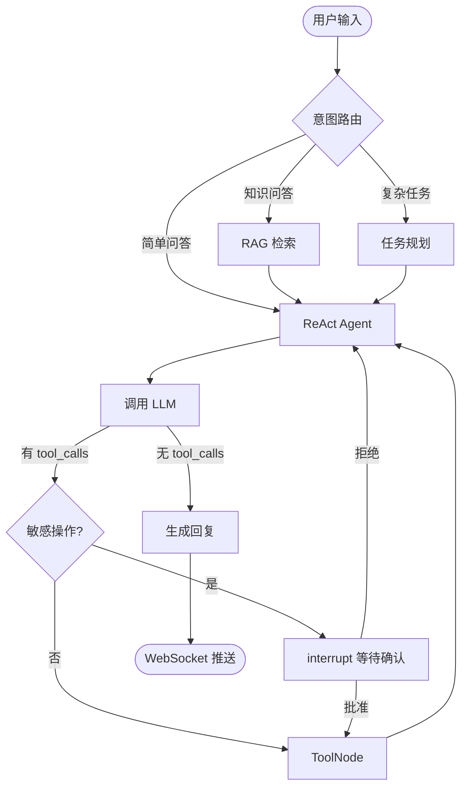

# 个人助理 Agent —— 设计方案（v4）

> **技术栈**：LangChain + LangGraph | Tauri 2 + Rust | Vue 3 | Python Sidecar | WebSocket

---

## 架构摘要

| 层级 | 技术 | 职责 |
|------|------|------|
| 表现层 | Vue 3 + TypeScript + Vite | 聊天、设置、工具卡片、HITL 确认 |
| 桌面壳 | Tauri 2（Rust） | 窗口、托盘、Sidecar 生命周期、原生 IPC |
| 原生层 | Tauri Commands | keyring、文件对话框、系统通知 |
| Agent 服务 | Python Sidecar（FastAPI + WebSocket） | LangGraph、Tools、Checkpoint、RAG |
| 工具层 | ToolRegistry（统一注册） | 云端能力本地化 + 业务 Tool + MCP |
| 持久化 | SQLite | Checkpoint、SessionStore、配置 |
| 通信 | WebSocket（127.0.0.1） | 前端 ↔ Sidecar 双向流式与控制 |

```
┌─────────────────────────────────────────────────────────┐
│  Vue 3 SPA（Tauri WebView）                              │
│  ChatView │ Settings │ ConfirmModal │ SessionSidebar    │
└──────────┬──────────────────────────┬───────────────────┘
           │ invoke                    │ WebSocket
           ▼                           ▼
┌──────────────────────┐    ┌─────────────────────────────┐
│  Rust (src-tauri)     │    │  Python Sidecar (FastAPI)    │
│  Sidecar 启停 │ 托盘  │───▶│  LangGraph Agent │ Tools    │
│  keyring │ 文件对话框 │    │  SessionStore │ Checkpoint  │
└──────────────────────┘    └─────────────────────────────┘
```

---

## 一、项目概述

### 1.1 项目目标

构建以 LLM 为推理核心的**本地桌面个人助理 Agent**，通过自然语言理解用户意图，自主完成：

- 任务管理（待办创建、提醒、优先级）
- 日程规划（日历查询、冲突检测）
- 信息检索（网页搜索、本地文件、知识库问答）
- 笔记整理（读写、摘要、标签）
- 项目管理（生命周期、任务分配、进度跟踪、文档管理）
- 跨应用操作（Outlook 邮件、Notion/飞书等，按需扩展）

### 1.2 核心能力

| 能力域 | 具体功能 |
|--------|----------|
| 任务管理 | 创建/更新/删除待办、设置提醒、优先级排序 |
| 日程管理 | 查询/创建/修改日历事件、冲突检测 |
| 信息检索 | 网页搜索、本地文件检索、知识库搜索 |
| 知识库 | 文档归档、RAG 问答 |
| 笔记整理 | 读写笔记、摘要、标签分类 |
| 项目管理 | 生命周期、任务分配、进度跟踪、文档管理 |
| 跨应用操作 | 本地 Outlook、Notion/飞书等 |

### 1.3 非功能性需求

| 维度 | 目标 |
|------|------|
| 响应延迟 | 简单任务 < 3s，复杂多步 < 15s |
| 可用性 | 桌面常驻、系统托盘、定时 + 事件触发 |
| 安全性 | 敏感操作二次确认；API Key 系统密钥链存储 |
| 可观测性 | 工具调用链、延迟、成功率日志 |
| 可扩展性 | LLM、工具、前端模块均可独立替换 |

---

## 二、技术选型

### 2.1 Agent：LangChain + LangGraph

| 组件 | 技术 | 职责 |
|------|------|------|
| 模型集成 | LangChain | LLM 接口、Tool、Prompt、RAG |
| 编排 | LangGraph | 有状态图、Checkpoint、HITL |
| Agent | `create_react_agent` | ReAct 循环 |
| 持久化 | `SqliteSaver` | 会话状态、断点恢复 |

**选型理由**

- LangChain 提供成熟的 Tool / Retriever / Embedding 生态
- LangGraph 原生支持有状态图、流式输出、中断等待用户确认，适合桌面助理场景
- 统一走 LangGraph 图编排，不使用已弃用的 `AgentExecutor`

### 2.2 桌面与 UI：Tauri + Vue

| 组件 | 说明 |
|------|------|
| Tauri 2 | 系统 WebView 桌面壳，体积小 |
| Rust | Sidecar 启停、托盘、keyring、文件对话框 |
| Vue 3 + Pinia | 响应式 UI、会话状态管理 |
| Vite | 开发与构建 |

**UI 布局**

```
┌─────────────────────────────────────────────────────┐
│  侧边栏          │  主聊天区                         │
│  · 会话列表      │  · 消息气泡（用户/助手/工具）      │
│  · 新建会话      │  · WebSocket 流式渲染             │
│  · 设置          │  · 工具调用卡片（可折叠）          │
├──────────────────┼───────────────────────────────────┤
│  输入区：文本框 + 发送 + 停止 + 附件                  │
├─────────────────────────────────────────────────────┤
│  状态栏：模型 | Token | WebSocket 连接 | Sidecar 状态 │
└─────────────────────────────────────────────────────┘
```

**设置面板**

- LLM 提供商配置（API Base URL、Model Name；Key 由 Rust keyring 管理）
- 温度 / Max Tokens / 超时 / 重试次数
- 工具开关与权限级别（云端能力本地实现 + 业务 Tool + MCP）
- 搜索后端选择（Tavily / DuckDuckGo / 自建 SearXNG）
- 代码沙箱与 bash 白名单配置

**职责划分**

| 能力 | Rust | Python |
|------|------|--------|
| LLM / Tool / LangGraph | — | ✓ |
| WebSocket 服务 | — | ✓ |
| 窗口 / 托盘 / 通知 | ✓ | — |
| API Key（keyring） | ✓ | 启动时注入 env |
| 文件选择对话框 / 屏幕截图 | ✓ | 接收路径；computer 截图 |

### 2.3 LLM：可插拔 Provider

**设计原则：业务代码不绑定任何单一厂商，通过配置切换 Provider。**

```yaml
# agent/config/llm_providers.yaml
default_provider: deepseek

providers:
  deepseek:
    type: openai_compatible
    base_url: https://api.deepseek.com/v1
    model: deepseek-chat
    api_key_env: DEEPSEEK_API_KEY
    supports_tool_call: true

  openai:
    type: openai_compatible
    base_url: https://api.openai.com/v1
    model: gpt-4o
    api_key_env: OPENAI_API_KEY
    supports_tool_call: true

  anthropic:
    type: anthropic
    model: claude-sonnet-4-6
    api_key_env: ANTHROPIC_API_KEY
    supports_tool_call: true

  qwen:
    type: openai_compatible
    base_url: https://dashscope.aliyuncs.com/compatible-mode/v1
    model: qwen-plus
    api_key_env: DASHSCOPE_API_KEY
    supports_tool_call: true

  ollama:
    type: ollama
    base_url: http://localhost:11434
    model: qwen2.5:7b
    supports_tool_call: true

  custom:
    type: openai_compatible
    base_url: https://your-gateway.com/v1
    model: your-model-name
    api_key_env: CUSTOM_API_KEY
    supports_tool_call: true
```

工厂方法 `create_llm(provider_cfg)` 基于 LangChain `init_chat_model`，支持 OpenAI 兼容 API、Anthropic 与 Ollama。**工具能力与 Provider 解耦**——所有工具均在 Sidecar 本地执行，不调用 Anthropic/OpenAI 等厂商的 Server Tool API。

| Provider 类型 | 接入方式 | Tool Call | 适用场景 |
|---------------|----------|-----------|----------|
| OpenAI 兼容 API | `base_url` + `api_key` | ✓ | DeepSeek、Qwen、Moonshot、自建网关 |
| OpenAI 官方 | `openai:gpt-4o` | ✓ | 高质量推理 |
| Ollama 本地 | `ollama:model` | ✓（视模型） | 隐私敏感、离线 |
| Anthropic | `claude-sonnet-4-6` | ✓ | 长上下文；Tool Call 稳定，适配本地工具 schema |
| OpenRouter | `openrouter:provider/model` | ✓ | 多模型统一入口 |

---

## 三、系统架构

### 3.1 分层

```
表现层    Vue 3（Tauri WebView）
    ↕ WebSocket + Tauri invoke
桌面壳    Rust：SidecarManager / Tray / Keyring
    ↕ spawn + health check
Agent层   Python：FastAPI + LangGraph + ToolRegistry
              ├─ 云端能力本地实现（web_search / bash / code_exec …）
              ├─ 业务 @tool（todo / calendar / email …）
              └─ MCP Tool（可选扩展）
    ↕
基础设施  SQLite / FAISS·Chroma / loguru / APScheduler
```

### 3.2 LangGraph 工作流



**核心节点**

| 节点 | 实现 | 说明 |
|------|------|------|
| ReAct Agent | `create_react_agent(model, tools, checkpointer=...)` | 标准推理-行动循环 |
| ToolNode | `langgraph.prebuilt.ToolNode(tools)` | 批量执行工具调用 |
| Human-in-the-loop | `langgraph.types.interrupt()` | 敏感操作暂停，等待 UI 确认 |
| Checkpoint | `SqliteSaver` | 会话持久化，支持多轮恢复 |

### 3.3 Agent 状态

```python
from typing import Annotated
from typing_extensions import TypedDict
from langgraph.graph.message import add_messages

class AgentState(TypedDict):
    messages: Annotated[list, add_messages]   # 对话历史（短期记忆）
    pending_action: dict | None               # 待确认的操作
    task_plan: list[str] | None               # 复杂任务步骤
    retrieved_docs: list | None               # RAG 检索结果
    metadata: dict                            # token 用量、耗时等
```

### 3.4 WebSocket 通信协议

**连接**：`ws://127.0.0.1:{port}/ws`（端口由 Rust 启动 Sidecar 后写入前端）

**客户端 → 服务端**

| type | 字段 | 说明 |
|------|------|------|
| `chat.send` | `thread_id`, `content`, `attachments?` | 发送消息，触发 Agent |
| `chat.stop` | `thread_id` | 中止当前生成 |
| `chat.resume` | `thread_id`, `decision`, `edited_args?` | HITL 恢复（approve/reject/edit） |
| `session.list` | — | 获取会话列表 |
| `session.create` | `title?` | 新建会话 |
| `session.delete` | `thread_id` | 删除会话 |
| `ping` | — | 心跳 |

**服务端 → 客户端**

| type | 字段 | 说明 |
|------|------|------|
| `connected` | `port`, `version` | 连接就绪 |
| `token` | `thread_id`, `content` | 流式文本片段 |
| `tool_start` | `thread_id`, `name`, `args`, `category?` | 工具开始（category: capability/business/mcp） |
| `tool_end` | `thread_id`, `name`, `result`, `category?`, `citations?` | 工具结束；web_search 附引用链接 |
| `tool_progress` | `thread_id`, `tool_name`, `status` | 长耗时工具中间态（搜索中、沙箱执行中） |
| `interrupt` | `thread_id`, `action`, `preview` | HITL 待确认 |
| `done` | `thread_id`, `metadata` | 本轮结束（含 token 用量） |
| `error` | `message`, `code?` | 错误 |
| `pong` | — | 心跳响应 |

**Vue 封装示例**

```typescript
// src/composables/useAgentWs.ts
export function useAgentWs(port: Ref<number>) {
  let ws: WebSocket | null = null;

  function connect() {
    ws = new WebSocket(`ws://127.0.0.1:${port.value}/ws`);
    ws.onmessage = (e) => {
      const msg = JSON.parse(e.data);
      switch (msg.type) {
        case 'token': appendToken(msg.content); break;
        case 'interrupt': showConfirm(msg); break;
        case 'done': finishTurn(msg.metadata); break;
      }
    };
  }

  function send(content: string, threadId: string) {
    ws?.send(JSON.stringify({ type: 'chat.send', thread_id: threadId, content }));
  }

  function resume(threadId: string, decision: 'approve' | 'reject', editedArgs?: object) {
    ws?.send(JSON.stringify({ type: 'chat.resume', thread_id: threadId, decision, edited_args: editedArgs }));
  }

  return { connect, send, resume };
}
```

**HITL 流程**

```
Agent interrupt → WS 推送 interrupt → Vue ConfirmModal
  → chat.resume { decision: "approve" | "reject" | "edit" }
  → graph.invoke(Command(resume=...)) 继续执行
```

**Rust 与 Sidecar**

- 启动：`app.shell().sidecar("agent-api")`，监听 stdout 获取 `READY port=xxxx`
- 健康：`GET http://127.0.0.1:{port}/health`
- 退出：先发 HTTP `POST /shutdown`，超时再 kill

---

## 四、模块设计

### 4.1 记忆系统

| 类型 | 存储 | 实现 | 用途 |
|------|------|------|------|
| 短期记忆 | LangGraph State `messages` | Checkpoint 自动持久化 | 当前会话上下文 |
| 长期记忆 | `langgraph.store` | SQLite Store | 用户偏好、常用模板 |
| 知识库 | FAISS / Chroma | LangChain `VectorStoreRetriever` | 个人文档 RAG |

**检索策略（每次用户输入前）**

1. 加载 Checkpoint 中的 `messages`（短期）
2. 从 Store 检索用户偏好（长期）
3. 若检测到知识问答意图，执行 RAG 检索，将结果注入 System Prompt

### 4.2 工具集成架构

**设计原则：云端工具本地化（Cloud Tool Local Port）**

Claude、OpenAI 等厂商在云端提供的 Agent 工具（网页搜索、网页抓取、代码沙箱、Shell、文件编辑、计算机控制等），**不在 API 侧调用其 Server Tool**，而是在本项目的 Python Sidecar（必要时配合 Rust 原生层）**本地复刻同等能力**。

| 本地化收益 | 说明 |
|------------|------|
| Provider 无关 | DeepSeek / Qwen / Ollama / Claude 共用同一套工具，不绑定 Anthropic |
| 成本可控 | 无 Server Tool 额外计费；搜索等可按需切换免费/自建后端 |
| 隐私 | 代码执行、文件操作、bash 均在用户机器沙箱内完成 |
| 可定制 | 域名白名单、命令白名单、HITL 策略完全自主 |

工具接口**参考 Claude Tool Schema**（命名与参数尽量对齐），便于模型稳定调用；**执行逻辑 100% 在 Sidecar 本地完成**。

#### 4.2.1 工具分类

| 类型 | 说明 | 示例 |
|------|------|------|
| **Capability Tool** | 复刻云端 Agent 通用能力 | `web_search`、`web_fetch`、`code_execution`、`bash`、`text_editor` |
| **Business Tool** | 个人助理业务逻辑 | `create_todo`、`read_calendar`、`send_email` |
| **MCP Tool** | 外部生态扩展（可选） | GitHub、Filesystem MCP Server |

```
┌──────────────────────────────────────────────────────────────┐
│                     ToolRegistry                              │
│  resolve() → [capability_tools, business_tools, mcp_tools]   │
└────────────────────────────┬─────────────────────────────────┘
                             │ 全部本地 ToolNode 执行
┌────────────────────────────▼─────────────────────────────────┐
│  LangGraph create_react_agent(model.bind_tools(all_tools))   │
└──────────────────────────────────────────────────────────────┘
```

#### 4.2.2 云端能力 → 本地实现映射

| 云端工具（参考） | 本地模块 | 本地技术栈 | 阶段 |
|------------------|----------|------------|------|
| `web_search` | `capability/web_search.py` | Tavily / DuckDuckGo / 自建 SearXNG | MVP |
| `web_fetch` | `capability/web_fetch.py` | httpx + trafilatura；PDF 用 pypdf | Phase 2 |
| `code_execution` | `capability/code_sandbox.py` | 受限 Python 子进程 / Docker（可选） | Phase 2 |
| `bash` | `capability/bash.py` | subprocess + 工作目录沙箱 + 命令白名单 | Phase 3 |
| `text_editor` | `capability/text_editor.py` | view / create / str_replace / insert | Phase 2 |
| `computer` | `capability/computer.py` | Rust 截图（Tauri）+ 键鼠模拟 | Phase 3 |
| `tool_search` | `capability/tool_search.py` | 对 ToolRegistry 元数据做 BM25/关键词检索 | Phase 3 |

**web_search 本地实现**

```python
@tool
def web_search(query: str, max_results: int = 5, allowed_domains: list[str] | None = None) -> str:
    """Search the web for current information. Returns summarized results with source URLs."""
    backend = get_search_backend()  # tavily | duckduckgo | searxng
    results = backend.search(query, max_results=max_results, domains=allowed_domains)
    return format_results_with_citations(results)
```

**web_fetch 本地实现**

```python
@tool
def web_fetch(url: str, max_chars: int = 50000) -> str:
    """Fetch and extract readable text content from a URL (HTML or PDF)."""
    resp = httpx.get(url, follow_redirects=True, timeout=30)
    text = trafilatura.extract(resp.text) or fallback_readability(resp.text)
    return text[:max_chars]
```

**code_execution 本地沙箱**

```python
@tool
def code_execution(code: str, language: str = "python") -> str:
    """Execute code in a restricted sandbox and return stdout/stderr."""
    return SandboxRunner(
        workspace=WORKSPACE_DIR, timeout=90,
        allowed_imports=["json", "math", "re", "datetime"], network=False,
    ).run_python(code)
```

**text_editor（对齐 Claude text_editor 命令语义）**

```python
@tool
def text_editor(command: str, path: str, file_text: str = "", old_str: str = "", new_str: str = "") -> str:
    """View, create, or edit files in the assistant workspace.

    Args:
        command: view | create | str_replace | insert
        path: Relative path within workspace
    """
    ...
```

**computer（Rust + Sidecar 协作）**

- Rust Tauri Command：`capture_screen()` 返回 PNG base64
- Sidecar `computer` 工具：解析 LLM 动作（click/type/scroll）→ 调用 Rust 或分平台键鼠库
- 高风险，默认关闭，启用需 HITL

#### 4.2.3 业务 Tool

```python
@tool
def create_todo(title: str, due_date: str = "", priority: str = "normal") -> str:
    """创建一条待办事项。"""
    ...

@tool
def send_email(to: str, subject: str, body: str) -> str:
    """发送电子邮件。此操作需要用户确认后才会执行。"""
    ...
```

#### 4.2.4 MCP 扩展（可选）

第三方 MCP Server 作为**补充**，不替代核心 Capability Tool：

```yaml
mcp_servers:
  github:
    transport: stdio
    command: npx
    args: ["-y", "@modelcontextprotocol/server-github"]
    env:
      GITHUB_TOKEN: "${GITHUB_TOKEN}"
    enabled: false
```

```python
async def load_mcp_tools(cfg: dict) -> list:
    client = MultiServerMCPClient({k: v for k, v in cfg.items() if v.get("enabled")})
    return await client.get_tools()
```

#### 4.2.5 工具配置（tools.yaml）

```yaml
defaults:
  requires_confirmation_risk: medium

capability:
  web_search:
    enabled: true
    risk: low
    backend: duckduckgo          # tavily | duckduckgo | searxng
    max_results: 5
    allowed_domains: []
  web_fetch:
    enabled: true
    risk: low
    max_chars: 50000
  code_execution:
    enabled: false
    risk: high
    requires_confirmation: true
    timeout_sec: 90
    network: false
    sandbox: subprocess          # subprocess | docker
  text_editor:
    enabled: false
    risk: medium
    workspace: ~/AssistantWorkspace
  bash:
    enabled: false
    risk: high
    requires_confirmation: true
    allowed_commands: [ls, cat, grep, find, git, python]
  computer:
    enabled: false
    risk: high
    requires_confirmation: true
  tool_search:
    enabled: false
    method: bm25

business:
  create_todo:       { enabled: true,  risk: low }
  list_todos:        { enabled: true,  risk: low }
  read_calendar:     { enabled: true,  risk: low }
  create_calendar_event: { enabled: true, risk: medium, requires_confirmation: true }
  read_file:         { enabled: false, risk: low }
  write_file:        { enabled: false, risk: high,  requires_confirmation: true }
  send_email:        { enabled: false, risk: high,  requires_confirmation: true }
  search_notes:      { enabled: false, risk: low }
```

#### 4.2.6 ToolRegistry

所有工具统一注册、统一本地执行，**与 LLM Provider 无关**：

```python
class ToolRegistry:
    def register(self, tool: BaseTool, category: str, meta: dict): ...
    def get_enabled_tools(self) -> list[BaseTool]: ...
    def requires_confirmation(self, tool_name: str) -> bool: ...
    async def resolve_all(self) -> list[BaseTool]:
        return self.get_enabled_tools() + await load_mcp_tools(...)

def create_agent(registry: ToolRegistry, checkpointer):
    tools = registry.get_enabled_tools()
    llm = create_llm(load_provider(get_default_provider())).bind_tools(tools)
    return create_react_agent(llm, tools, checkpointer=checkpointer)
```

#### 4.2.7 WebSocket 工具事件

| type | 字段 | 说明 |
|------|------|------|
| `tool_start` | `category: capability/business/mcp` | 工具开始 |
| `tool_end` | `category`, `citations?` | 结束；web_search 附 URL 引用 |
| `tool_progress` | `tool_name`, `status` | 沙箱/抓取等长耗时中间态 |

Vue `ToolCallCard` 按 `category` 分组：Capability（通用能力）、Business（助理事务）、MCP（外部扩展）。

#### 4.2.8 工具清单与阶段

| 工具 | 分类 | 本地实现 | 阶段 |
|------|------|----------|------|
| `web_search` | Capability | Tavily / DuckDuckGo / SearXNG | MVP |
| `create_todo` / `list_todos` | Business | SQLite | MVP |
| `read_calendar` / `create_calendar_event` | Business | 系统日历 API | MVP |
| `web_fetch` | Capability | httpx + trafilatura | Phase 2 |
| `text_editor` | Capability | 工作区文件 CRUD | Phase 2 |
| `code_execution` | Capability | 受限子进程沙箱 | Phase 2 |
| `read_file` / `write_file` | Business | 工作区读写 | Phase 2 |
| `send_email` | Business | Outlook/SMTP | Phase 2 |
| `search_notes` | Business | FAISS RAG | Phase 2 |
| MCP 外部工具 | MCP | MCP Server | Phase 2 |
| `bash` | Capability | 沙箱 Shell | Phase 3 |
| `tool_search` | Capability | BM25 工具检索 | Phase 3 |
| `computer` | Capability | Tauri 截图 + 键鼠 | Phase 3 |

### 4.3 安全设计

**敏感操作 Human-in-the-loop 流程**

```
Agent 生成 tool_call
    → LangGraph interrupt() 暂停图执行
    → WebSocket 推送 interrupt 事件
    → Vue ConfirmModal（展示操作预览）
    → 用户 [批准] / [编辑参数] / [拒绝]
    → chat.resume → graph.invoke(Command(resume=user_response))
    → 批准则执行工具，拒绝则让 Agent 重新规划
```

**其他安全措施**

- API Key 通过 Rust `keyring` 存入系统密钥链，Sidecar 启动时注入临时环境变量，不写明文配置文件
- Sidecar 仅绑定 `127.0.0.1`，Tauri CSP 限制前端访问范围
- 文件工具与 `text_editor` 限制在 `~/AssistantWorkspace` 沙箱目录
- `code_execution` / `bash` 默认禁网，高风险操作 HITL 确认
- 工具调用日志审计（操作类型、参数摘要、时间戳）
- 输入校验：拒绝 shell 注入模式

### 4.4 RAG 知识库（Phase 2）

```
文档导入 → RecursiveCharacterTextSplitter 分块
         → Embedding（与 LLM 同 Provider 或本地模型）
         → 存入 FAISS/Chroma
         → 检索时 top-k + MMR 去重
         → 注入 Prompt 上下文
```

---

## 五、项目结构

```
my-agent-rs/
├── package.json
├── vite.config.ts
├── src/                          # Vue 3 前端
│   ├── App.vue
│   ├── components/
│   │   ├── ChatPanel.vue
│   │   ├── SessionSidebar.vue
│   │   ├── ToolCallCard.vue
│   │   └── ConfirmModal.vue
│   ├── composables/
│   │   ├── useAgentWs.ts
│   │   └── useTauriNative.ts
│   ├── stores/
│   │   ├── session.ts
│   │   └── settings.ts
│   └── views/
│       ├── ChatView.vue
│       └── SettingsView.vue
├── src-tauri/
│   ├── Cargo.toml
│   ├── tauri.conf.json
│   ├── capabilities/default.json
│   ├── binaries/                 # agent-api-{target-triple}
│   └── src/
│       ├── lib.rs
│       ├── sidecar.rs
│       ├── tray.rs
│       ├── keyring.rs
│       └── commands/
│           ├── mod.rs
│           └── screen.rs         # computer 工具：屏幕截图
├── agent/                        # Python Sidecar
│   ├── pyproject.toml
│   ├── main.py
│   ├── config/
│   │   ├── llm_providers.yaml
│   │   ├── tools.yaml
│   │   └── app.yaml
│   └── src/
│       ├── api/
│       │   ├── ws.py             # WebSocket 路由
│       │   └── health.py
│       ├── agent/
│       │   ├── graph.py
│       │   ├── state.py
│       │   └── runner.py
│       ├── llm/
│       │   ├── factory.py
│       │   └── providers.py
│       ├── tools/
│       │   ├── registry.py       # ToolRegistry 统一注册
│       │   ├── mcp_loader.py     # MCP 工具加载
│       │   ├── capability/       # 云端能力本地实现
│       │   │   ├── web_search.py
│       │   │   ├── web_fetch.py
│       │   │   ├── code_sandbox.py
│       │   │   ├── text_editor.py
│       │   │   ├── bash.py
│       │   │   ├── computer.py
│       │   │   └── tool_search.py
│       │   ├── business/         # 个人助理业务工具
│       │   │   ├── calendar.py
│       │   │   ├── todo.py
│       │   │   ├── file.py
│       │   │   └── email.py
│       │   └── sandbox/          # 沙箱运行时
│       │       └── runner.py
│       ├── memory/
│       └── infra/
├── scripts/
│   ├── build_sidecar.py
│   └── dev.ps1
├── data/
│   ├── checkpoints/
│   ├── vectorstore/
│   └── workspace/
└── tests/
    ├── agent/
    └── e2e/
```

---

## 六、核心依赖

**Rust（`src-tauri/Cargo.toml`）**

```toml
[dependencies]
tauri = { version = "2", features = ["tray-icon"] }
tauri-plugin-shell = "2"
tauri-plugin-dialog = "2"
tauri-plugin-notification = "2"
keyring = "3"
serde = { version = "1", features = ["derive"] }
tokio = { version = "1", features = ["full"] }
reqwest = "0.12"
```

**Python（`agent/pyproject.toml`）**

```toml
[project]
dependencies = [
    "langchain>=0.3",
    "langgraph>=0.3",
    "langchain-openai",
    "langchain-anthropic",         # Anthropic LLM（工具仍本地执行）
    "langchain-mcp-adapters",
    "langchain-community",
    "duckduckgo-search",           # web_search 免费后端
    "tavily-python",                # web_search 可选后端
    "trafilatura",                 # web_fetch 正文提取
    "httpx",
    "fastapi>=0.115",
    "uvicorn[standard]",
    "websockets",
    "pyyaml",
    "loguru",
    "apscheduler",
    "faiss-cpu",
]
```

**前端（`package.json`）**

```json
{
  "dependencies": {
    "vue": "^3",
    "pinia": "^2",
    "@tauri-apps/api": "^2",
    "@tauri-apps/plugin-shell": "^2",
    "@tauri-apps/plugin-dialog": "^2"
  }
}
```

---

## 七、实施路线

### Phase 1 — MVP（2 周）

| 任务 | 产出 |
|------|------|
| Tauri + Vue 脚手架 | 可运行窗口 |
| ToolRegistry + tools.yaml | capability / business 工具注册 |
| 本地 web_search | DuckDuckGo / Tavily 后端 |
| Rust Sidecar 启停 + 健康检查 | 开发/生产双模式 |
| FastAPI WebSocket + LangGraph | web_search + 待办 + 日程 + 流式 |
| Vue ChatPanel + ToolCallCard | 工具卡片（capability/business 分组） |
| SqliteSaver | 多会话持久化 |

**验收标准**：任意 Provider 下可用本地 `web_search`；通过自然语言完成搜索、查日程、建待办。

### Phase 2 — 核心功能（3 周）

| 任务 | 产出 |
|------|------|
| web_fetch / text_editor / code_execution | 云端能力本地实现 Phase 2 |
| 扩展 business 工具 | 文件读写、邮件、笔记 RAG |
| MCP 工具接入 | GitHub 等 MCP Server |
| 长期记忆 Store | 用户偏好持久化 |
| Human-in-the-loop | ConfirmModal 敏感操作确认 |
| Rust keyring | API Key 安全存储 |
| 知识库导入 | 拖拽上传文档、自动索引 |
| 系统托盘 | 后台常驻、快捷唤起 |

### Phase 3 — 智能化（2 周）

| 任务 | 产出 |
|------|------|
| 复杂任务规划节点 | 多步骤任务自动分解 |
| bash / computer / tool_search | 高权限能力 + 沙箱 |
| 反思节点 | 执行结果自检与重试 |
| 定时触发 | 后台提醒、定时任务 |

### Phase 4 — 发布（2 周）

| 任务 | 产出 |
|------|------|
| Sidecar 打包 | PyInstaller → `src-tauri/binaries/` |
| 桌面安装包 | `tauri build`（.msi / .dmg / .AppImage） |
| CI 多平台 | 各 target-triple Sidecar 矩阵构建 |
| 异常恢复 | 网络超时重试、Provider 降级 |
| 测试覆盖 | Agent 核心模块单元测试 |

---

## 八、关键技术要点

### 8.1 LangGraph vs AgentExecutor

| 对比项 | AgentExecutor（已弃用） | LangGraph |
|--------|-------------------------|-----------|
| 状态管理 | 无原生持久化 | Checkpoint 原生支持 |
| 人工介入 | 难以实现 | `interrupt()` 一等公民 |
| 流式输出 | 有限 | `stream()` 多模式 |
| 自定义流程 | 受限 | StateGraph 任意编排 |

### 8.2 WebSocket 流式集成

```python
# agent/src/agent/runner.py
async def stream_to_ws(ws, user_input, thread_id):
    config = {"configurable": {"thread_id": thread_id}}
    async for msg, _ in graph.astream(
        {"messages": [{"role": "user", "content": user_input}]},
        config,
        stream_mode="messages",
    ):
        if msg.content:
            await ws.send_json({"type": "token", "thread_id": thread_id, "content": msg.content})
    await ws.send_json({"type": "done", "thread_id": thread_id, "metadata": {...}})
```

### 8.3 前端与 Sidecar 性能

- Agent 推理仅在 Python Sidecar 中执行，Rust/UI 线程不阻塞
- WebSocket token 更新节流（~50ms 批量刷新 DOM）
- WebSocket 断线自动重连（指数退避）
- 长对话：Checkpoint 截断 + 摘要节点
- Sidecar 开发模式直接 `uvicorn`；生产模式 PyInstaller 二进制

### 8.4 Provider 降级策略

```python
PROVIDER_FALLBACK_CHAIN = ["deepseek", "qwen", "ollama"]

def invoke_with_fallback(prompt, providers):
    for name in providers:
        try:
            llm = create_llm(load_provider(name))
            return llm.invoke(prompt)
        except (TimeoutError, ConnectionError) as e:
            logger.warning(f"Provider {name} failed: {e}")
    raise RuntimeError("All LLM providers unavailable")
```

### 8.5 云端能力本地化要点

- **接口对齐、执行本地**：工具名/参数参考 Claude Tool Schema，但一律经 LangChain `@tool` + ToolNode 在 Sidecar 执行
- **搜索后端可切换**：`tools.yaml` 配置 `duckduckgo`（免费）/ `tavily`（质量）/ `searxng`（自建）
- **沙箱隔离**：`code_execution` 与 `bash` 限制工作目录、超时、网络；默认关闭 network
- **Provider 无关**：切换 LLM 不更换工具集，仅更换推理模型
- **computer 跨层**：截图走 Rust Tauri Command，动作解析在 Sidecar

---

## 九、风险与应对

| 风险 | 影响 | 应对 |
|------|------|------|
| 模型 Tool Call 不稳定 | 工具调用失败 | 选 Function Call 优化模型；重试 + 降级 |
| 本地 web_search 质量不及云端 | 回答不准 | 可切换 Tavily；配合 web_fetch 二次抓取 |
| 代码沙箱逃逸 | 系统被侵入 | 子进程隔离 + 禁网 + 工作目录限制；可选 Docker |
| bash 误执行危险命令 | 数据损坏 | 命令白名单 + HITL 强制确认 |
| MCP Server 启动失败 | 工具不可用 | 启动时 health check；降级为 capability + business |
| API 限流 / 超时 | 响应中断 | 超时配置 + Provider 降级链 |
| Sidecar 冷启动慢 | 首屏等待 | 启动页 + health 轮询 |
| WebSocket 断连 | 流式中断 | 前端重连；服务端按 thread_id 恢复 Checkpoint |
| PyInstaller 体积大 | 安装包过大 | 按需裁剪；向量库可选下载 |
| 敏感操作误执行 | 数据丢失 / 误发 | HITL 强制确认 |
| 跨平台 Sidecar 构建 | 打包复杂 | CI 矩阵构建各 target-triple |
| Tauri 杀 Sidecar 不干净 | 僵尸进程 | HTTP `/shutdown` + 超时 force kill |

---

## 十、总结

本方案以 **LangGraph** 为 Agent 编排核心，**LangChain** 提供模型与工具集成，**ToolRegistry** 统一管理**云端能力本地实现**（Capability Tool）、**业务 Tool** 与 **MCP** 扩展，**Tauri + Rust** 构建轻量桌面壳与原生能力，**Vue 3** 负责交互界面，**Python Sidecar** 承载全部 AI 与工具执行逻辑，**WebSocket** 实现双向流式与控制。工具与 LLM Provider 完全解耦，任意模型均可使用同一套本地工具。

推荐实施路径：

```
MVP（对话 + 本地 web_search + 待办/日程 + WebSocket UI）
  → 核心功能（web_fetch/code_execution/text_editor + RAG + MCP + HITL）
    → 智能化（bash/computer/tool_search + 规划 + 后台触发）
      → 发布（Sidecar + Tauri Bundle + CI）
```

每个阶段均有明确验收标准，确保持续可交付。
